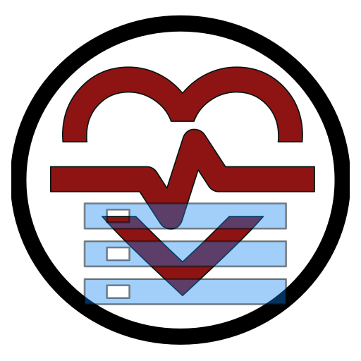

<p align="center">
  
</p>

# Control Tensión Arterial & Pulsaciones (Autoalojada Multi-usuario) 🩺🐳


Versión **autoalojada en servidor / NAS (Synology, Unraid, Docker Compose)** diseñada para el seguimiento y gestión privada de la tensión arterial y pulsaciones en el **entorno familiar (hasta 10 usuarios)**.

> ✨ **Metodología de Desarrollo**: Este proyecto ha sido conceptualizado, diseñado y guiado mediante **Vibe Coding**, utilizando asistencia avanzada de Inteligencia Artificial para la generación de código y arquitectura.

---

## 💡 ¿Qué versión elegir? (Autoalojada vs. Individual)

Este repositorio corresponde a la **Versión Autoalojada Multi-usuario (Docker & SQLite)**.

- 🐳 **Versión Autoalojada (Este Repositorio)**: Diseñada para instalar en tu propio servidor doméstico o NAS (Synology, Unraid, Docker Compose) y permitir a **varios miembros de la familia (hasta 10 usuarios)** controlar su tensión arterial de forma centralizada con base de datos SQLite y **autenticación 2FA TOTP**.
- 📱 **[Versión Individual / Móvil Android (APK / PWA)](https://github.com/el-rocho/cta-elrocho)**: Si prefieres una aplicación móvil **100% offline, nativa Android (APK)** y sin necesidad de instalar un servidor ni crear cuentas de usuario, te recomendamos utilizar la versión individual para un único dispositivo.

### 🔄 Migración e Importación desde la Versión Individual (Móvil/APK):
Si tú o algún familiar habéis estado utilizando la versión móvil individual y queréis migrar vuestro historial al servidor autoalojado:
1. En la app móvil individual, pulsa **Exportar** y descarga el archivo de copia `.csv`.
2. En el servidor autoalojado, inicia sesión con tu usuario familiar (ej. *"Carmen"*).
3. Abre **Exportar / Imprimir** &rarr; pestaña **Importar** y selecciona el archivo `.csv`.
4. El servidor asociará automáticamente todas tus tomas históricas a tu perfil de forma privada e inmune a duplicados en SQLite.

---

## 🚀 Características Principales de la Versión Autoalojada

- **Multiusuario Familiar Centralizado (~10 Usuarios)**: Cuentas individuales para cada miembro de la familia con aislamiento estricto de mediciones, historial y preferencias.
- **Base de Datos SQLite Persistente**: Almacenamiento ágil y ligero en un único archivo (`/data/cta_database.sqlite`). Copias de seguridad ultrasimples respaldando la carpeta `/data`.
- **Autenticación Segura & Doble Factor (2FA / TOTP)**:
  - Cifrado de contraseñas con **bcrypt**.
  - Sesiones cifradas en cookies seguras `HttpOnly`.
  - **Soporte 2FA TOTP (RFC 6238)** con Código QR compatible con Google Authenticator, Aegis, Authy, Bitwarden, 1Password, etc.
  - **8 Códigos de rescate de emergencia** de un solo uso.
- **Panel de Administración Familiar**: La primera persona registrada se convierte en Administrador, pudiendo dar de alta a familiares, restablecer claves o administrar permisos.
- **Misma Experiencia de Diseño Cuidada**:
  - **Filtro de Síndrome de Bata Blanca**: Algoritmo médico inteligente que descarta tomas iniciales elevadas producidas por la ansiedad del momento.
  - **Informes PDF Médicos Bilingües**: Gráfico temporal con doble eje Y (tensión arterial + línea de pulsaciones) y tabla de registros.
  - **Exportación e Importación CSV**: Copias de seguridad automáticas con metadatos.
  - **Interfaz Bilingüe (Español / Inglés)**: Adaptable a móviles, tabletas y ordenadores.

---

## 🐳 Despliegue con Docker Compose (Recomendado)

Crea un archivo `docker-compose.yml` en tu servidor o NAS:

```yaml
version: '3.8'

services:
  cta-elrocho-server:
    image: ghcr.io/el-rocho/cta-elrocho-selhosted:latest
    container_name: cta-tension-arterial
    restart: unless-stopped
    ports:
      - "3000:3000"
    environment:
      - PORT=3000
      - NODE_ENV=production
      - DATA_DIR=/app/data
    volumes:
      - ./data:/app/data
```

Inicia el contenedor:
```bash
docker compose up -d
```

Accede desde tu navegador o móvil en tu red local: `http://<IP_DE_TU_SERVIDOR>:3000`.

---

## 🛡️ Filtro de Síndrome de Bata Blanca

El **Filtro de Síndrome de Bata Blanca** mitiga la distorsión generada por el sesgo de alerta o ansiedad inicial del paciente al colocarse el manguito de tensión.

### 🔬 Cómo funciona el algoritmo:
1. **Agrupación Consecutiva**: Se agrupan dentro de una misma sesión las tomas donde el intervalo entre una toma y la anterior sea menor al margen configurado (**3, 5 o 10 minutos**).
2. **Sesiones de 2 tomas**: Si la 1ª toma es significativamente superior a la 2ª ($\ge 8$ mmHg sistólica / $\ge 4$ mmHg diastólica), se descarta la 1ª toma reteniendo la 2ª. En caso contrario, se promedian ambas.
3. **Sesiones de 3 tomas**: Se descarta siempre la 1ª toma y se calcula la media con las 2 tomas restantes.
4. **Sesiones de 4 o más tomas**: Se descarta la 1ª toma y se continúan descartando las siguientes tomas iniciales elevadas ($\ge 8$ mmHg sistólica / $\ge 4$ mmHg diastólica) respecto a la media de las restantes, siempre y cuando queden al menos 3 tomas válidas para calcular la media definitiva.

---

## 🛠️ Desarrollo Local

```bash
# Instalar dependencias
npm install

# Iniciar en modo desarrollo
npm run dev

# Compilar producción y ejecutar servidor
npm run build
npm run server
```
